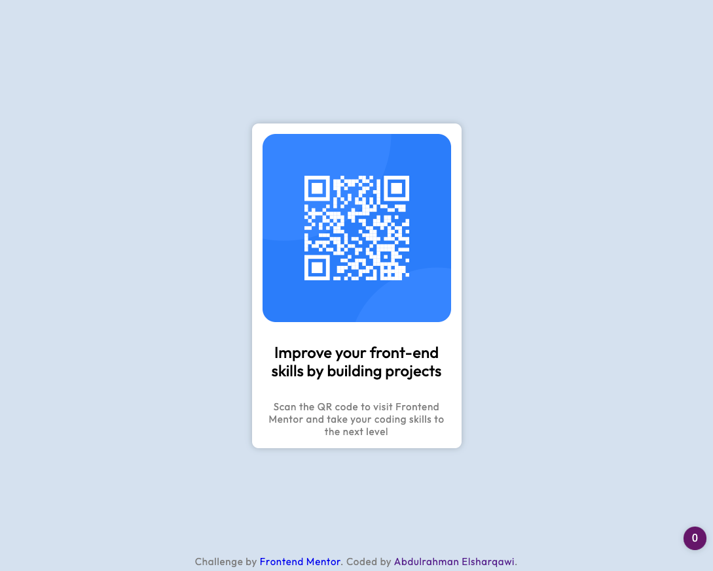

# Frontend Mentor - QR code component solution

This is a solution to the [QR code component challenge on Frontend Mentor](https://www.frontendmentor.io/challenges/qr-code-component-iux_sIO_H). Frontend Mentor challenges help you improve your coding skills by building realistic projects.

## Table of contents

- [Overview](#overview)
  - [Screenshot](#screenshot)
  - [Links](#links)
  - [Built with](#built-with)
- [Author](#author)

## Overview

### Screenshot

### Links

- Solution URL: [Github](https://github.com/sharqawiDev/fm-qr-code)
- Live Site URL: [Netlify](https://your-live-site-url.com)

### Built with

- HTML5
- CSS3
- Flexbox

## Author

- Website - [Abdulrahman Elsharqawi](https://sharqawi.dev/)
- Frontend Mentor - [@sharqawiDev](https://www.frontendmentor.io/profile/sharqawiDev)
- Twitter - [@sharqawiDev](https://www.twitter.com/sharqawiDev)
